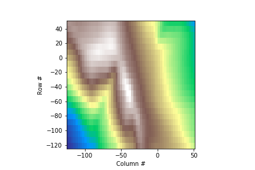
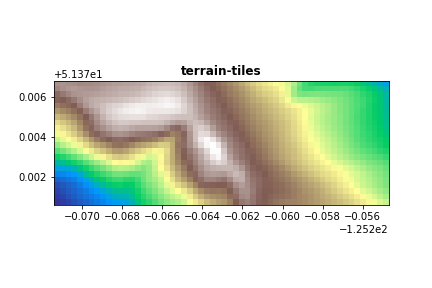

# terraincache

(Yet another) basic Python script for downloading and accessing [Mapzen Terrain Tiles](https://registry.opendata.aws/terrain-tiles/) geotiffs from AWS.

## Installation

    pip install terraincache

Set the `TERRAINCACHE` environment variable to save typing:

    export TERRAINCACHE=/users/snorris/Data/terrain-tiles

## Usage

### Python module

    from matplotlib import pyplot as plt
    import rasterio

    from terraincache import TerrainTiles

    bounds =[-125.2714, 51.3706, -125.2547, 51.3768]

    # Initialize with bounds and zoom of interest
    tt = TerrainTiles(bounds, 11)

    # load to numpy array
    array = tt.load()

    # plot the array directly
    plt.imshow(array, cmap='terrain', extent=bounds)

Dump to file and plot the array using `rasterio.plot.show()` (for correct axis labels):

    tt.save(out_file="dem.tif")
    with rasterio.open("dem.tif", "r") as src:
        fig, ax = plt.subplots()
        rasterio.plot.show(src, ax=ax, title='terrain-tiles', cmap="terrain")

### CLI

    $ terraincache --help
    Usage: terraincache [OPTIONS]

      Write terrain tiles to geotiff

    Options:
      -o, --out_file, --out-file PATH
                                      Output file name/path
      --bounds TEXT                   Bounds: "left bottom right top" or "[left,
                                      bottom, right, top]".  [required]
      -z, --zoom INTEGER              Web map zoom level  [required]
      -p, --cache-dir, --cache_dir TEXT
                                      Path to cache folder
      -tr, --resolution FLOAT         Output dataset target resolution in meters
                                      (square pixels)
      --bounds-crs, --bounds_crs TEXT
                                      CRS of provided bounds
      --dst-crs, --dst_crs TEXT       Target coordinate reference system.
      -r, --resampling_algorithm [bilinear|nearest|cubic|cubicspline|lanczos|average|mode]
                                      GDAL resampling algorithm
      -v, --verbose                   Increase verbosity.
      -q, --quiet                     Decrease verbosity.
      --help                          Show this message and exit.

For example, create a geotiff around the summit of Mt Fairweather (at BC / AK border) that aligns with the BC TRIM DEM.  Note that this is almost certainly upsampling the data available, see below link to review source resolutions.

    terraincache \
      --bounds "336637.5, 1597112.5, 346637.5, 1607112.5" \
      --bounds-crs EPSG:3005 \
      --zoom 11 \
      -tr 25 \
      -r bilinear \
      -o dem.tif

## Data sources

See the [data sources reference document](https://github.com/tilezen/joerd/blob/master/docs/data-sources.md)

## Credits / other implementations

- [terrain-tiles](https://registry.opendata.aws/terrain-tiles)
- [Mapzen provided script](https://github.com/tilezen/joerd/blob/master/docs/examples/collect.py)
- [planetutils](https://github.com/interline-io/planetutils)
- [dem](https://github.com/dgketchum/dem)
- [elevatr](https://github.com/jhollist/elevatr)